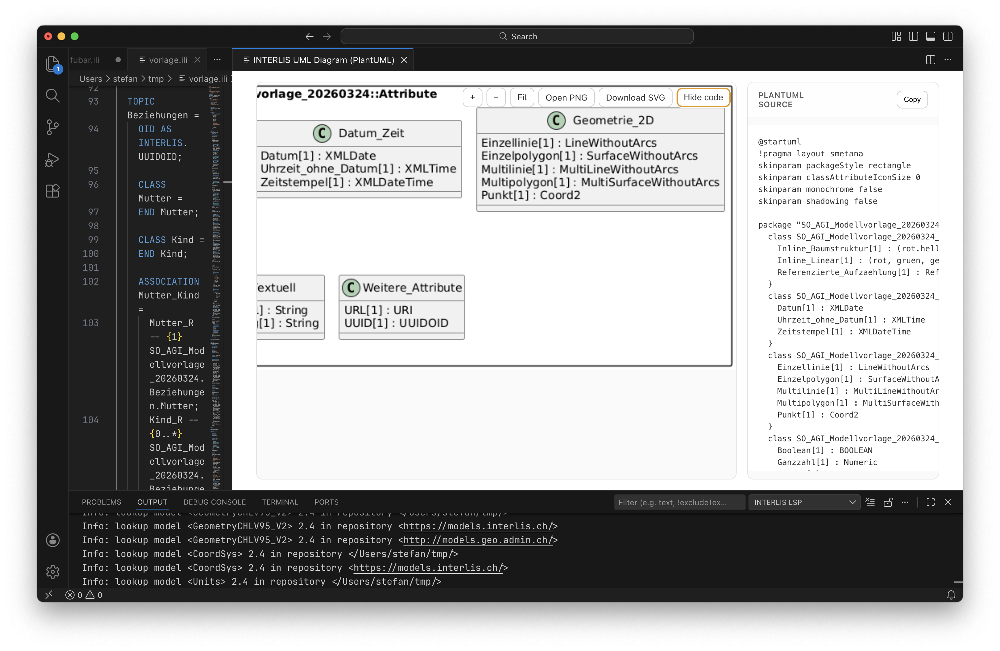
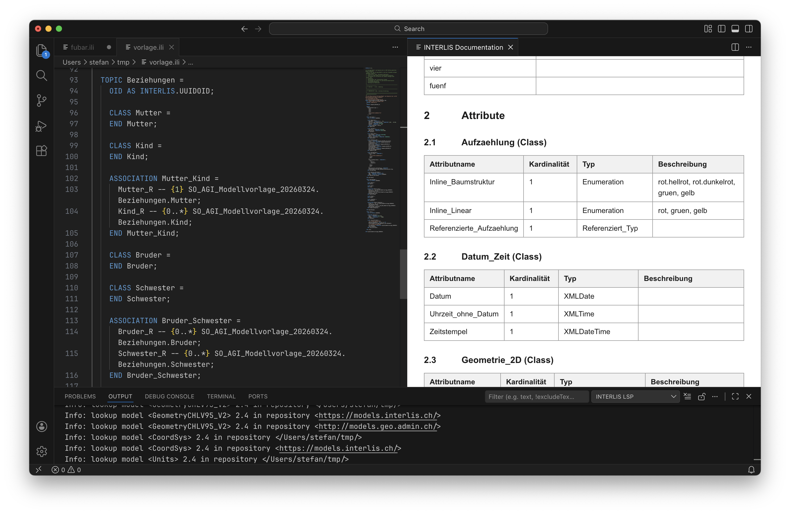

## Diagrammeditor

Der Diagrammeditor hilft dir, die Struktur eines Modells schneller zu erfassen. Er zeigt Klassen, Beziehungen und Vererbungen in einer visuellen Form, die sich gut für Review, Abstimmung und Orientierung eignet.

Öffne in der Command Palette `INTERLIS: Open diagram editor`. Je nach Einstellung wird der Diagrammeditor auch automatisch neben einer geöffneten `.ili`-Datei angezeigt.

Im Alltag sind vor allem diese Aktionen relevant:

- `INTERLIS: Auto-layout active diagram` für ein sauberes Layout
- `INTERLIS: Force refresh active diagram` nach grösseren Änderungen oder wenn du bewusst neu laden willst

Das Diagramm zeigt dir die Struktur des Modells, ist aber nicht selbst der Ort für Modelländerungen. Bearbeitet wird weiterhin im Texteditor.

Der Diagrammeditor ist als Lese- und Review-Werkzeug gedacht. Wenn sich Text und Diagramm unterscheiden, speichere die Datei und aktualisiere das Diagramm. Für Modelländerungen solltest du weiterhin den Texteditor verwenden.

## UML-Vorschauen und GraphML

Nicht jeder Anwendungsfall braucht den interaktiven Diagrammeditor. Für Dokumentation, Weitergabe und externe Werkzeuge sind statische UML-Ausgaben oft praktischer.

Die IDE bietet dir drei direkte Wege für UML-Ausgaben:

- `INTERLIS: Show Mermaid UML class diagram`
- `INTERLIS: Show PlantUML class diagram`
- `INTERLIS: Export UML as GraphML`

Mermaid eignet sich gut für schnelle Vorschauen und leichte Einbindung in Markdown-basierte Dokumentation. PlantUML ist hilfreich, wenn in deinem Umfeld bereits PlantUML verwendet wird. GraphML eignet sich, wenn du das Ergebnis in anderen Diagramm- oder Analysewerkzeugen weiterverwenden willst.

Je nach Ausgabeform kannst du erzeugte Grafiken direkt weiterverwenden oder in nachgelagerten Werkzeugen weiterbearbeiten.

Die Ausgaben basieren auf dem aktuellen Modellstand. Wenn Inhalte fehlen oder veraltet wirken, speichere die Datei und starte die Vorschau oder den Export erneut. Für das Verhalten der UML-Ausgaben stehen zusätzliche Optionen in den Einstellungen bereit, etwa zur Anzeige von Attributen oder zur Darstellung abstrakter Typen.

## HTML-Vorschau und DOCX-Export

Nicht alle Beteiligten wollen ein `.ili`-Modell direkt lesen. Mit HTML-Vorschau und DOCX-Export erzeugst du daraus eine Form, die sich besser für Reviews, Freigaben und Weitergabe eignet.

Für die beiden wichtigsten Dokumentationsausgaben stehen diese Kommandos bereit:

- `INTERLIS: Show documentation as HTML`
- `INTERLIS: Export documentation as DOCX`

Die HTML-Vorschau eignet sich für ein schnelles Durchsehen direkt in der IDE. Der DOCX-Export ist dann sinnvoll, wenn du ein weitergebbares Dokument brauchst, das ausserhalb der IDE geöffnet und kommentiert werden kann.

Typische Einsatzfälle:

- fachlicher Review mit Personen, die nicht im Modelltext arbeiten
- Weitergabe an Projektpartner
- formale Dokumentationsstufen zwischen Modellversionen

Die Qualität der Ausgabe hängt direkt am Modellzustand. Speichere das Modell vor einer HTML-Vorschau oder einem DOCX-Export und behebe möglichst zuerst vorhandene Fehler. So vermeidest du veraltete oder unvollständige Dokumentation.
