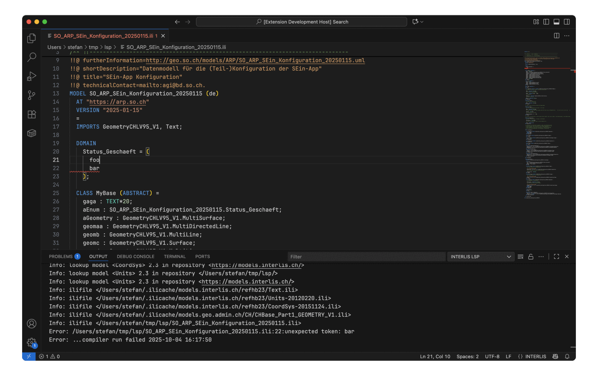

::: {.hero-banner}
# INTERLIS IDE

## A dedicated workspace for modeling data with INTERLIS.

[Get started](intro.qmd){.btn .btn-action .btn-action-primary role="button"}
:::

::: {.preview-wrap}
{.preview-image}
:::
