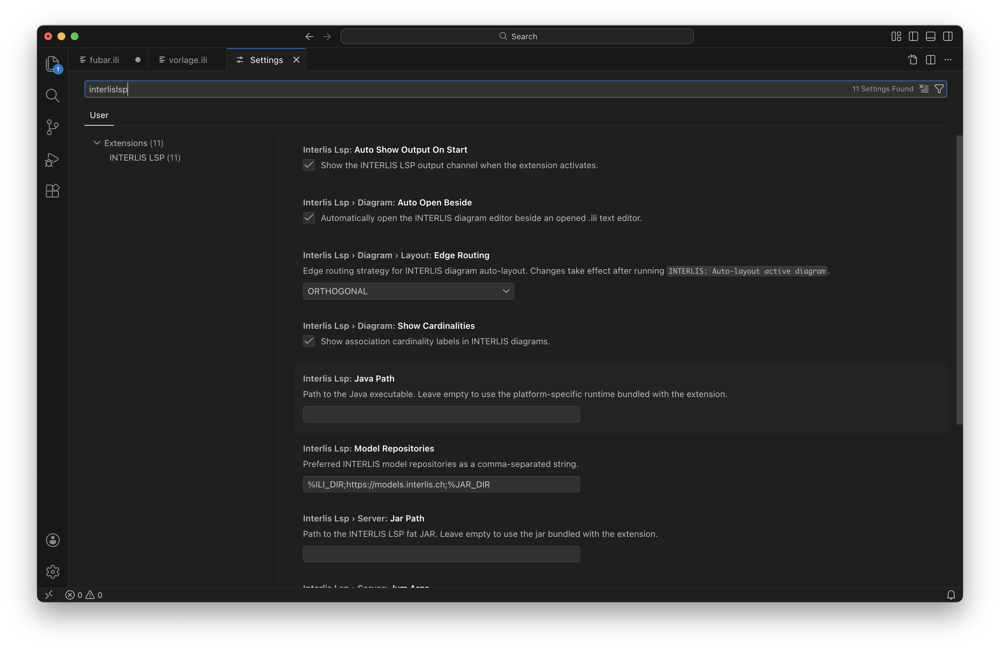

## Kommandos
Die meisten spezialisierten INTERLIS-Funktionen erreichst du über die Command Palette. Das ist der schnellste Weg zu Compile, Diagrammen und Exporten.

Öffne die Command Palette und suche nach `INTERLIS`. Die wichtigsten Kommandos sind:

- `INTERLIS: New from Template` legt ein neues Modell aus einer Vorlage an.
- `INTERLIS: Compile current file` prüft die aktuelle Datei gezielt neu.
- `INTERLIS: Open diagram editor` öffnet den UML-ähnlichen Diagrammeditor.
- `INTERLIS: Auto-layout active diagram` ordnet das aktive Diagramm neu an.
- `INTERLIS: Force refresh active diagram` lädt das aktive Diagramm bewusst neu.
- `INTERLIS: Show Mermaid UML class diagram` erzeugt eine Mermaid-UML-Vorschau.
- `INTERLIS: Show PlantUML class diagram` erzeugt eine PlantUML-Vorschau.
- `INTERLIS: Show documentation as HTML` zeigt eine HTML-Dokumentation des Modells.
- `INTERLIS: Export UML as GraphML` exportiert UML-Strukturen als GraphML.
- `INTERLIS: Export documentation as DOCX` erzeugt eine DOCX-Dokumentation.

Einige Kommandos bauen auf dem aktuellen Modellzustand auf. Wenn Ergebnisse unerwartet leer oder veraltet sind, speichere die Datei zuerst und führe das Kommando anschliessend erneut aus.

## Einstellungen

Die Standardeinstellungen sind für viele Teams ausreichend. Über die Settings kannst du das Verhalten aber an gemeinsame Modellablagen, Diagrammgewohnheiten oder eine angepasste Laufzeit anpassen.

Öffne die Einstellungen der IDE und suche nach `INTERLIS LSP`. Für den Alltag sind vor allem diese Optionen relevant:

- `interlisLsp.modelRepositories`: zusätzliche Modellquellen für Importe, Typauflösung und Validierung
- `interlisLsp.template.url`: Vorlage für `INTERLIS: New from Template`
- `interlisLsp.autoShowOutputOnStart`: Output-Kanal beim Start automatisch anzeigen
- `interlisLsp.diagram.autoOpenBeside`: Diagrammeditor automatisch neben `.ili`-Dateien öffnen
- `interlisLsp.diagram.layout.edgeRouting`: Linienfuhrung im Diagramm steuern
- `interlisLsp.diagram.showCardinalities`: Kardinalitäten im Diagramm ein- oder ausblenden
- `interlisLsp.uml.attributeMode`: Detailgrad für UML-Ausgaben steuern
- `interlisLsp.uml.deemphasizeAbstractTypes`: abstrakte Typen in UML-Ausgaben optisch zurücknehmen

Fortgeschrittene oder installationsnahe Optionen:

- `interlisLsp.server.jarPath`: eigenes Server-JAR statt der mitgelieferten Version verwenden
- `interlisLsp.javaPath`: eigene Java-Laufzeit verwenden
- `interlisLsp.server.jvmArgs`: zusätzliche JVM-Argumente für Spezialfälle

Beispiel:

```json
{
  "interlisLsp.modelRepositories": "%ILI_DIR;https://models.interlis.ch;%JAR_DIR",
  "interlisLsp.diagram.autoOpenBeside": true,
  "interlisLsp.diagram.showCardinalities": true,
  "interlisLsp.uml.attributeMode": "OWN"
}
```



Für die meisten Anwender sind nur wenige Einstellungen wirklich notwendig. Beginne mit `modelRepositories`, wenn Importe aus externen Quellen fehlen, und mit den Diagramm- oder UML-Optionen, wenn du die Visualisierung anpassen willst. Die Laufzeit-Einstellungen für eigenes Java oder eigenes Server-JAR solltest du nur verändern, wenn du bewusst von der mitgelieferten Standardkonfiguration abweichst.

## Grenzen und Verhalten

Diese Seite schafft realistische Erwartungen. Sie hilft dir zu verstehen, welche Funktionen für den Alltag gedacht sind und wo du bewusst mit bestimmten Grenzen rechnen solltest.

Nutze diese Hinweise immer dann, wenn eine Funktion anders wirkt als erwartet oder wenn du für die Teamdokumentation klar beschreiben willst, was der Editor leistet.

Wichtige Punkte:

- Der Diagrammeditor ist ein Visualisierungswerkzeug und keine grafische Modellierungsoberfläche.
- Rename arbeitet auf Symbolen, nicht als freie Textsuche.
- Manche Funktionen werden erst nach dem Speichern oder nach einem erneuten Compile voll aussagekräftig.
- Import- und Typvorschläge hängen davon ab, ob Modelle im Workspace oder in konfigurierten Repositories auflösbar sind.
- Statische UML-Ausgaben und Dokumentationsexporte spiegeln den aktuellen Modellstand wider und sollten bei grösseren Änderungen bewusst neu erzeugt werden.

Nicht im Vordergrund des Editors stehen dagegen Funktionen wie eine grafische Bearbeitung im Diagramm oder eine vollständige Freitext-Refaktorierung beliebiger Kommentare und Textfragmente.

Wenn du die IDE dokumentierst oder im Team einführen willst, beschreibe Funktionen am besten entlang der tatsächlichen Arbeitsabläufe: schreiben, prüfen, navigieren, visualisieren und exportieren. Das verhindert Missverständnisse über Dinge, die absichtlich ausserhalb des Fokus liegen.

## Probleme beheben

Diese Seite hilft dir bei typischen Alltagsproblemen: kein Output, fehlende Vorschläge, kein Diagramm oder Probleme beim Start der Anwendung.

## So benutzt du sie

### Ich sehe keine Compile-Ausgabe

Öffne `View -> Output` und wähle im Dropdown `INTERLIS LSP`. Wenn der Output leer bleibt, speichere die Datei erneut oder führe `INTERLIS: Compile current file` aus.

### Ich bekomme keine sinnvollen Vorschläge

Prüfe diese Punkte in dieser Reihenfolge:

- Die Datei hat die Endung `.ili`.
- Der Sprachmodus ist `INTERLIS`.
- Die Datei wurde mindestens einmal gespeichert.
- Das Modell ist im aktuellen Zustand nicht vollständig durch frühe Grundfehler blockiert.
- Externe Modellquellen sind unter `interlisLsp.modelRepositories` korrekt eingetragen.

### Das Diagramm fehlt oder ist veraltet

Speichere die Datei und öffne dann `INTERLIS: Open diagram editor`. Wenn das Diagramm bereits offen ist, nutze `INTERLIS: Force refresh active diagram`. Für ein saubereres Bild hilft oft zusätzlich `INTERLIS: Auto-layout active diagram`.

### Rename oder Navigation liefern nichts

Setze den Cursor direkt auf ein Modellsymbol, nicht auf freien Text oder nur auf ein Kommentarfragment. Wenn das Modell stark inkonsistent ist, behebe zuerst die gravierendsten Fehler und probiere es danach erneut.

### Die Anwendung lässt sich unter macOS nicht öffnen

Bei unsignierten Downloads kann macOS die App blockieren. In vielen Fällen hilft:

```bash
xattr -dr com.apple.quarantine InterlisIDE.app
```

### Darauf solltest du achten

Viele Probleme haben dieselbe erste Lösung: Datei speichern, Problems-Ansicht prüfen, den Output-Kanal öffnen und den betroffenen Befehl gezielt erneut ausführen. Wenn das nicht reicht, melde ein Issue unter [github.com/edigonzales/interlis-ide/issues](https://github.com/edigonzales/interlis-ide/issues).
