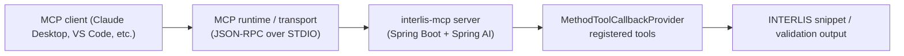

`interlis-mcp` is a [Model Context Protocol (MCP)](https://modelcontextprotocol.io) server that helps large language models author correct INTERLIS 2 model definitions. It exposes a catalogue of Spring AI tools for building model, topic, domain, class, association, structure, attribute, constraint, and identifier snippets that IDE assistants can assemble into complete schemas. The project is open source on [GitHub](https://github.com/edigonzales/interlis-mcp).

## Overview
- ✅ STDIO-based MCP server built with Spring Boot and Spring AI's MCP starter.
- ✅ Tooling focused on generating valid INTERLIS snippets and validating identifiers.
- ✅ Ready to plug into Claude Desktop, VS Code MCP clients, or any MCP-compliant agent runtime.

## Architecture at a glance

## Tool reference
The server registers its MCP tools via Spring's `MethodToolCallbackProvider`. Each tool returns an object containing at least `iliSnippet`; several also provide `cursorHint` values to guide editors where to place the caret.

### Model and topic helpers
- **`createModelSnippet`** – Generate a model skeleton (`MODEL … END`). Parameters: `name` (required) plus optional `lang`, `uri`, `version`, and `imports`. Defaults fill in `lang = "de"`, `version = today`, and `uri = https://example.org/<name>`.
- **`createTopicSnippet`** – Produce a `TOPIC` block. Parameters: `name` (required), optional `oidType`, and `isAbstract` flag.

### Domains and units
- **`createEnumDomainSnippet`** – Emit a `DOMAIN` definition with enumerated `items` in order.
- **`createNumericDomainSnippet`** – Emit a numeric `DOMAIN` with `name`, `min`, `max`, and optional `unitFqn`.
- **`createUnitSnippet`** – Define a custom unit via `name`, `kind` (e.g., `LENGTH`), and base unit such as `INTERLIS.m`.

### Class and structure builders
- **`createClassSnippet`** – Build a `CLASS` block with optional abstract flag, `EXTENDS`, `OID`, and `attrLines`.
- **`createStructureSnippet`** – Same as the class helper but for `STRUCTURE` definitions without OIDs.
- **`createAssociationSnippet`** – Create an `ASSOCIATION` with role descriptors. Parameters: `name` and at least two `roles` (`name`, `classFqn`, `card`).

### Attribute helpers
- **`createAttributeLineV2`** – Preferred endpoint for a single attribute. Accepts `name`, optional `mandatory`, `collection` (`NONE`, `LIST_OF`, `BAG_OF`), and a `typeSpec` containing either `domainFqn` or a `baseType`. Numeric base types expect `min`, `max`, and optional `unitFqn`; text kinds support an optional `length`.
- **`createStructureAttributeLine`** – Emit an attribute referencing a `STRUCTURE` with the same optional `mandatory` and `collection` controls.
- **Deprecated helpers** – `createAttributeLine` and `createSnippet` exist for compatibility and immediately instruct clients to migrate to the newer variants.

### Constraint helpers
- **`createUniqueConstraint`** – Wrap attribute names in a `CONSTRAINTS` block with `UNIQUE`.
- **`createMandatoryConstraint`** – Build a `MANDATORY CONSTRAINT` expression.
- **`createSetConstraint`** – Produce a multi-line `SET CONSTRAINT` block.
- **`createPresentIfConstraint`** – Ensure an attribute is present under a given condition.
- **`createValueRangeConstraint`** – Restrict an attribute to a specified range.
- **`createExistenceConstraint`** – Require a reference attribute to target one of the supplied class FQNs.

### Identifier utilities
- **`sanitizeIdentifier`** – Convert arbitrary strings into valid INTERLIS identifiers and flag if the value changed.
- **`validateIdentifier`** – Validate identifiers against `^[A-Za-z][A-Za-z0-9_]*$` and return `{ valid: true }` on success.
- **`validateFqn`** – Validate a dot-separated fully qualified name.
