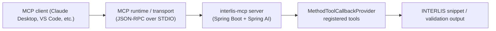

`interlis-mcp` is a [Model Context Protocol (MCP)](https://modelcontextprotocol.io) server that helps large language models author correct INTERLIS 2 model definitions. It exposes a catalogue of Spring AI tools for building model, topic, domain, class, association, structure, attribute, constraint, and identifier snippets that IDE assistants can assemble into complete schemas. Explore the project on [GitHub](https://github.com/edigonzales/interlis-mcp).

## Overview

- ✅ STDIO-based MCP server built with Spring Boot and Spring AI's MCP starter.
- ✅ Tooling focused on generating valid INTERLIS snippets and validating identifiers.
- ✅ Ready to plug into Claude Desktop, VS Code MCP clients, or any MCP-compliant agent runtime.

## Architecture at a glance

## Tool catalogue

The server registers its tools through Spring's `MethodToolCallbackProvider`, returning objects that include an `iliSnippet` and (where helpful) a `cursorHint` so clients know where to place the caret after inserting generated code.

### Model and topic helpers

- **`createModelSnippet`** – Generate a `MODEL … END` skeleton with optional language, URI, version, and import configuration.
- **`createTopicSnippet`** – Produce a `TOPIC` block, optionally marking it abstract and supplying an `OID` type declaration.

### Domains and units

- **`createEnumDomainSnippet`** – Emit a domain with enumerated items.
- **`createNumericDomainSnippet`** – Describe numeric ranges and optional units.
- **`createUnitSnippet`** – Declare custom units with the desired base type and reference unit.

### Class and structure builders

- **`createClassSnippet`** – Build a `CLASS` block with optional abstract flag, inheritance, OID, and prepared attribute placeholders.
- **`createStructureSnippet`** – Generate a `STRUCTURE` definition similar to class generation but without OIDs.
- **`createAssociationSnippet`** – Assemble an `ASSOCIATION` complete with role descriptors, class FQNs, and cardinalities.

### Attribute helpers

- **`createAttributeLineV2`** – Preferred attribute builder supporting mandatory flags, collection kinds, numeric ranges, text lengths, and other base types.
- **`createStructureAttributeLine`** – Reference a `STRUCTURE` within an attribute, including optional multiplicities.
- **Deprecated** – `createAttributeLine` and `createSnippet` remain for compatibility but return guidance to adopt the newer endpoints.

### Constraint helpers

- **`createUniqueConstraint`** – Wrap attributes in a `UNIQUE` constraint block.
- **`createMandatoryConstraint`** – Output a `MANDATORY CONSTRAINT` using an arbitrary boolean expression.
- **`createSetConstraint`** – Produce a multi-line `SET CONSTRAINT` block.
- **`createPresentIfConstraint`** – Require an attribute when a condition is met.
- **`createValueRangeConstraint`** – Limit attribute values to the specified range.
- **`createExistenceConstraint`** – Ensure reference attributes target one of the provided class FQNs.

### Identifier utilities

- **`sanitizeIdentifier`** – Convert arbitrary strings into legal INTERLIS identifiers and flag modifications.
- **`validateIdentifier`** – Enforce `^[A-Za-z][A-Za-z0-9_]*$` and return a validation result.
- **`validateFqn`** – Check dot-separated fully qualified names before generating snippets.

## Client integration tips

- Tool parameters follow MCP JSON serialization conventions; supply objects and arrays exactly as described above.
- Many helpers validate identifiers and FQNs before emitting snippets, returning descriptive errors that IDEs can surface immediately.
- Use the returned `cursorHint` coordinates to position the editor caret after inserting generated snippets.
- Because the transport is STDIO-based, keep standard input open (for example `docker run --rm -i interlis-mcp`) and disable TTY allocation so JSON-RPC messages remain clean.
